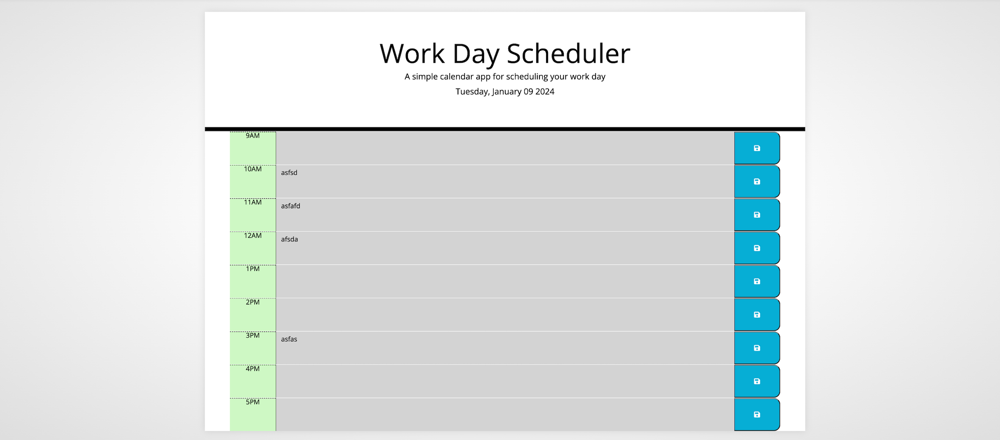

# Work Day Scheduler

##  Description
The application helps the user to create a work schedule where they could input their tasks broken down by hour. The current hour will show a different colour on the screen in this case red but it is changeable. While the past hours will appear grey, the upcoming hours appear green. The user is able to save their tasks on local storage.

##  Table of Contents
<!-- vscode-markdown-toc -->
*  [Deployed Page](#DeployedPage)
*  [Installation](#Installation)
*  [Credits](#Credits)
*  [License](#License)

<!-- vscode-markdown-toc-config
	numbering=true
	autoSave=true
	/vscode-markdown-toc-config -->
<!-- /vscode-markdown-toc -->

##  Deployed Page
- 

- [Deployed Github Page](https://beatak777.github.io/diary-planner/)

##   Installation
No Installation necessary although it is not forbidden to do so. If you decide to install here are the steps for you:
1. Download or clone repository
3. Navigate to project directory
2. Start testing it out in your browser

##   Credits

- Default files provided by [edX Bootcamp](https://www.edx.org/course/skills-bootcamp-in-front-end-web-development).
- Code refactoring by [Bea Konya](https://github.com/beatak777).
- Additional guidance received from a coder friend who wished to stay anonymous.
- Table of Contents was Created with the Visual Studio Code Extension 'Markdown TOC' available [here](https://marketplace.visualstudio.com/items?itemName=dumeng.markdown-toc).
- ChatGPT provided help at times when my code was not working properly.

##   License
MIT License.
For further information please refer to the LICENSE in the repo.